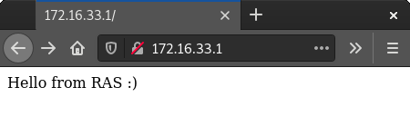
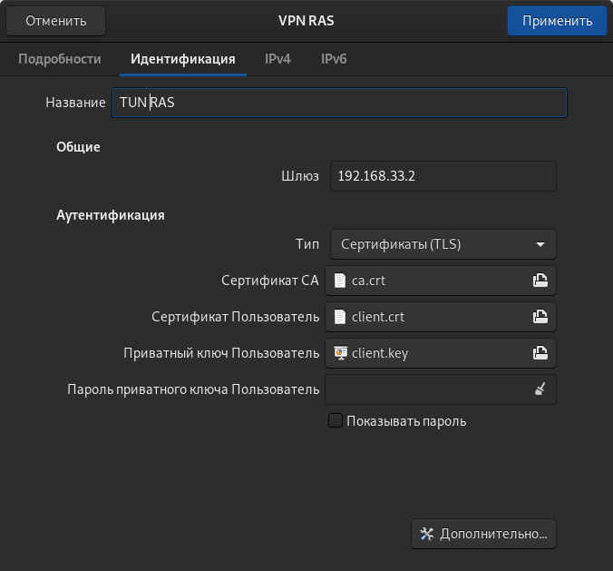
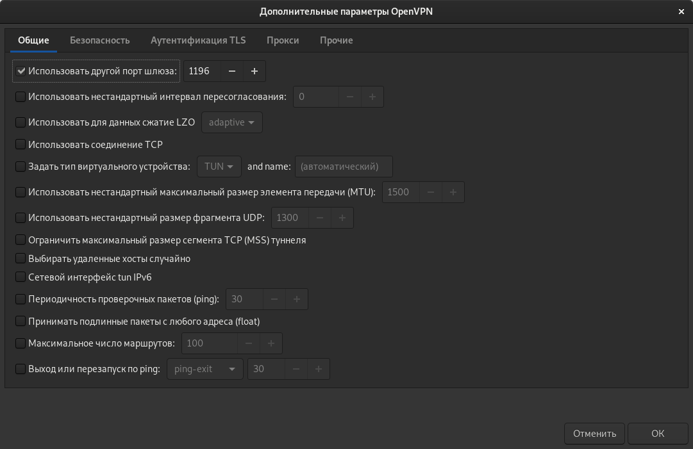
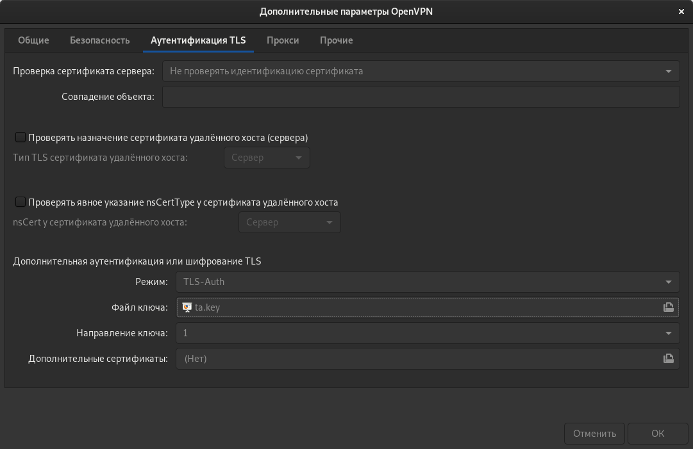
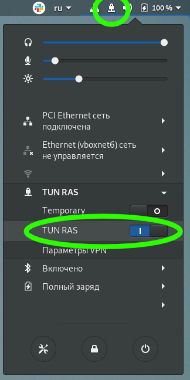

#  VPN

Между двумя виртуалками поднять vpn в режимах
* tun;
* tap; 
* Прочуствовать разницу.

Поднять RAS на базе OpenVPN с клиентскими сертификатами, подключиться с локальной машины на виртуалку.

3*. Самостоятельно изучить, поднять ocserv и подключиться с хоста к виртуалке

## Исполнение

<a name='regards'></a> Выражаю благодарность однокурсникам lupus (Юрий) и Сергею Артемову за помощь в освоении данного материала и настройке виртуального окружения.

Я добился того, что:
* стенд разворачивается автоматом с нужными конфигами, генерацией ключей (кроме их подписывания - об это ниже)
* имеется проверка на работоспособность:
  * статус `systemctl ...`
  * лог `/var/log/...`
  * интерфейсы

Текущая настройка идет в `tun`, считая что для связи между хоставми необходима маршрутизация, то есть сетефой уровень связности (L3).
В `tap` возможно объединить только при наличии канальной связности устройств (L2).

### Разворачивание сервера

Для генерации ключей используется утилита EasyRSA.

```shell
cd 031/vm/
cd ../vm/
vagrant destroy -f && vagrant up 
python3 v2a.py -o ../ansible/inventories/hosts # Это уже как кредо
cd ../ansible/
```

```shell
ansible-playbook playbooks/generate_vpn_server_certs.yml > ../files/generate_vpn_server_certs.yml.txt
```

Обратите внимание на итоговое предупреждение `playbooks/generate_vpn_server_certs.yml`.

[details --no-link]:[лог `playbooks/generate_vpn_server_certs.yml`](./files/generate_vpn_server_certs.yml.txt)

К сожалению, команда `sign-req` не автоматизируема, что связано с невозможностью осуществления автоматического ввода ответа на вопросы утилиты по факту ключевой фразы к корневому сертификату центра авторизации

```shell
cd ../vm
vagrant ssh server
```

Это внутри виртуалки `server`:

```shell
cd /home/vagrant/common/temp/easyrsa/ 
./easyrsa sign-req server server # <--- вот тут вводим неавтоматизируемые ответы

exit
```

__Замечание__: так как OpenVPN сервер работать будет так же и на не стандартных портах, то в политику SELinux необходимо внести коррективы  (все уже реализовано в плейбуке, но лучше проверить вручную, у меня порты были свободны).
```shell
semanage port -l | grep 1194
  openvpn_port_t                 tcp      1194
  openvpn_port_t                 udp      1194

semanage port -l | grep 1195
semanage port -l | grep 1196

semanage port -a -t openvpn_port_t -p udp 1195 
semanage port -a -t openvpn_port_t -p udp 1196
```

Продолжаем разворачивание инфрастуктуры.

```shell
cd ../ansible
ansible-playbook playbooks/configure_openvpn_server.yml > ../files/configure_openvpn_server.yml.txt
```

[details --no-link]:[лог `playbooks/configure_openvpn_server.yml`](./files/configure_openvpn_server.yml.txt)

### Демонстрация работоспособности сервера

```shell
ansible-playbook playbooks/check_openvpn_server.yml  > ../files/check_openvpn_server.yml.txt
```

[details --no-link]:[лог `playbooks/check_openvpn_server.yml`](./files/check_openvpn_server.yml.txt)

`/sbin/ip addr`

[details --no-link]:[содержание в проекции на tun, tap `ip addr`](./files/server-_sbin_ip-addr-|-awk--v-RS='(^|)[0-9]+:-'-'_^(tun|tap)[0-9]*:_-{print}')


TUN:

[details --no-link]:[статус `systemctl status openvpn@server-tun.service`](./files/server-systemctl-status-openvpn@server-tun.service.txt)

[details --no-link]:[лог `sudo cat /var/log/openvpn_openvpn-tun.log`](./files/server-sudo-cat-_var_log_openvpn_openvpn-tun.log.txt)

[details --no-link]:[лог `sudo cat /var/log/openvpn_openvpn-tun-status.log`](./files/server-sudo-cat-_var_log_openvpn_openvpn-tun-status.log.txt)

TAP:

[details --no-link]:[статус `systemctl status openvpn@server-tap.service`](./files/server-systemctl-status-openvpn@server-tap.service.txt)

[details --no-link]:[лог `sudo cat /var/log/openvpn_openvpn-tap.log`](./files/server-sudo-cat-_var_log_openvpn_openvpn-tap.log.txt)

[details --no-link]:[лог `sudo cat /var/log/openvpn_openvpn-tap-status.log`](./files/server-sudo-cat-_var_log_openvpn_openvpn-tap-status.log.txt)

TUN-RAS:

[details --no-link]:[статус `systemctl status openvpn@server-tun-ras.service`](./files/server-systemctl-status-openvpn@server-tun-ras.service.txt)

[details --no-link]:[лог `sudo cat /var/log/openvpn_openvpn-tun-ras.log`](./files/server-sudo-cat-_var_log_openvpn_openvpn-tun-ras.log.txt)

[details --no-link]:[лог `sudo cat /var/log/openvpn_openvpn-tun-ras-status.log`](./files/server-sudo-cat-_var_log_openvpn_openvpn-tun-ras-status.log.txt)

### Клиент

```shell
ansible-playbook playbooks/generate_vpn_client_certs.yml  > ../files/generate_vpn_client_certs.yml.txt
```

[details --no-link]:[лог `playbooks/generate_vpn_client_certs.yml`](./files/generate_vpn_client_certs.yml.txt)

Опять, так как `sign-req` не автоматизируема:

```shell
cd ../vm
vagrant ssh server
```

Это внутри виртуалки `server`:

```shell
cd /home/vagrant/common/temp/easyrsa/ 
./easyrsa sign-req client client # <--- вот тут вводим не автоматизируемые ответы
```

```shell
exit
cd ../ansible
```

Конфигурируем клиента TUN:

```shell
ansible-playbook playbooks/configure_openvpn_clienttun.yml > ../files/configure_openvpn_clienttun.yml.txt
```

[details --no-link]:[лог `playbooks/configure_openvpn_clienttun.yml`](./files/configure_openvpn_clienttun.yml.txt)

Конфигурируем клиента TAP:

```shell
ansible-playbook playbooks/configure_openvpn_clienttap.yml > ../files/configure_openvpn_clienttap.yml.txt
```

[details --no-link]:[лог `playbooks/configure_openvpn_clienttap.yml`](./files/configure_openvpn_clienttap.yml.txt)

Собираем в кучу сертификаты для клиента TUN-RAS:

```shell
ansible-playbook playbooks/configure_openvpn_clienttunras.yml > ../files/configure_openvpn_clienttunras.yml.txt
```

[details --no-link]:[лог `playbooks/configure_openvpn_clienttunras.yml`](./files/configure_openvpn_clienttunras.yml.txt)

```text
Ready. Use cert files for access to vpn 192.168.33.2 from your desktop client
```

### Демонстрация работоспособности клиента

```shell
ansible-playbook playbooks/check_openvpn_client.yml  > ../files/check_openvpn_client.yml.txt
```

[details --no-link]:[лог `playbooks/check_openvpn_client.yml`](./files/check_openvpn_client.yml.txt)


Проверка клиента TUN:

[details --no-link]:[лог в проекции на tun `ip addr`](./031/files/clienttun-_sbin_ip-addr-|-awk--v-RS='(^|)[0-9]+:-'-'_^(tun|tap)[0-9]*:_-{print}'.txt)


[details --no-link]:[лог `systemctl status openvpn@client.service.txt`](./files/clienttun-systemctl-status-openvpn@client.service.txt)

Проверка клиента TAP:

[details --no-link]:[лог `systemctl status openvpn@client.service.txt`](./files/clienttap-systemctl-status-openvpn@client.service.txt)

Проверка клиента TUN-RAS:

Для демонстрации примера "удаленного" доступа к ресурсам VPN, не видимых из "внешнего" мира

```shell
ansible-playbook playbooks/ras_additional.yml > ../files/ras_additional.yml.txt
```

[details --no-link]:[лог `ansible-playbook playbooks/ras_additional.yml`](./031/files/ras_additional.yml.txt)

Проверка локальной работы веб-сервера

```shell
cd ../vm
vagrant ssh server

[vagrant@server ~]$ curl 127.0.0.1:80
curl: (7) Failed connect to 127.0.0.1:80; В соединении отказано

[vagrant@server ~]$ curl 192.168.33.2:80
curl: (7) Failed connect to 192.168.33.2:80; В соединении отказано

[vagrant@server ~]$ curl 172.16.33.1:80
Hello from RAS :) # <--- Работает на сервере исключительно внутри VPN

exit
```

Теперь можно произвести подключение внешнего клиента к VPN серверу (на практике далеко в облаке с пробросом единственного порта):

```shell
sudo openvpn --config /etc/openvpn/ras_client.conf
```

С такими параметрами 

[details --no-link]:[содержание `ras_client.conf`](./files/ras_client.conf)


Получив "удаленный" доступ исключительно из-под VPN сети к серверу:




К сожалению "тумблер" Network Manager имеет своеобразные нюансы и не дает до конца сделать такой доступ, хотя VPN соединение поднимается и стабильно










